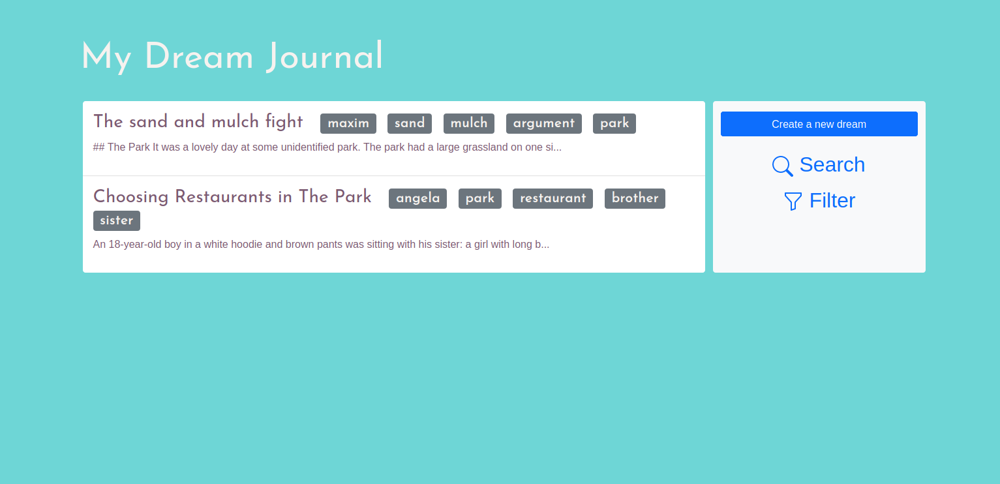

Dream Journal is a simple dream journal application built with the python [flask](https://flask.palletsprojects.com/) package. It runs on a simple database with the help of [flask sqlalchemy](https://flask-sqlalchemy.palletsprojects.com). Dream Journal is ready to go and can be easily installed and developed on. The journal app is open source and may be modied under the GNU GPL v3 license.

## What is a dream journal?
A dream journal is just waht it sounds like: a journal that records your dreams. A dream journal can help you understand your dreams, but many people write in it because it calms them or otherwise find it an interesting thing to do. This dream journal applicaiton can be installed locally, so you can run it offline, whenever you want to. The benefits of this dream journal application is that it is simple, but allows you to filter, organize and search dreams.

## Quick Links
* [Quickstart](docs/1-quickstart.html)
* [Documentation](docs)
* [Contribute](contribute)

